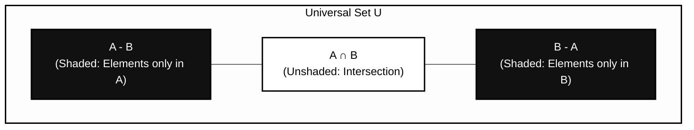

### Question 1 (MSQ)
Let $A = \{\emptyset, 1, \{1\}\}$ and the power set of $A$ is denoted by $P(A)$, then which of the following statement is/are true?
- A) $\emptyset \in P(A)$ and $\emptyset \in A$
- B) $\{\emptyset, \{1\}\} \subseteq P(A)$ and $\{\emptyset, \{1\}\} \subseteq A$
- C) $A \cap P(A) = \emptyset$
- D) $A \cup P(A) = P(A)$
- Correct: A, B

### Question 2 (MSQ)
Let $A = \{\emptyset, \{1\}, \{\emptyset\}, \{1, \emptyset\}\}$ and $B = \emptyset$ then which of the following statement is/are True? [Assume $P(A)$ represents the power set of $A$]
- A) $B \in A$ and $B \subseteq A$
- B) $A \cap B = A \times B$
- C) $|A \cup B| = |A|$ and $|A \cap B| = 1$
- D) $(A - B) = P(\{\emptyset, 1\})$
- Correct: A, B, D

### Question 3 (MSQ)
Consider the following Venn diagram for the set $X$:

Which of the following expression(s) represents the shaded area of above diagram?

* A) $(A \cup B) - (A \cap B)$
* B) $(A \oplus B)$
* C) $(A - B) \cup (B - A)$
* D) $A \cup (B - A)$
* Correct: A, B, C

### Question 4 (MSQ)

Consider a set $A = \{1, 2\}$ and if $R$ is a binary relation on $A$ then which of the following statement is/are true?

* A) $R$ is always transitive relation on $A$.
* B) If $R = \{(1, 2), (2, 1)\}$ then it is irreflexive relation on $A$.
* C) If $R = \{(1, 2)\}$ then it is transitive relation on $A$.
* D) If $R = \{(1, 1), (2, 2)\}$ then $R$ is an equivalence relation on $A$.
* Correct: B, C, D

### Question 5 (MSQ)

Which of the following expression(s) is/are equivalent to $(A - B) \cup (B \cap \overline{A})$?

* A) $(A \cup B) - (A \cap B)$
* B) $(B - A) \cup (A - B)$
* C) $[A - (A \cap B)] \cup [B - (A \cap B)]$
* D) $(\overline{\overline{A} \cap \overline{B}}) - A$
* Correct: A, B, C

### Question 6 (NAT)

How many subset of $X = \{\emptyset, \{\emptyset\}, \{1\}\}$ are power set of any set?

* Answer: 3
* Correct: 3

### Question 7 (NAT)

Consider the following three sets:
$A = \{x \in \mathbb{N} \mid 1 \le x \le 600 \text{ and } x \text{ is divisible by } 2\}$
$B = \{x \in \mathbb{N} \mid 1 \le x \le 600 \text{ and } x \text{ is divisible by } 3\}$
$S = (\overline{A} \cap \overline{B})$
Then what is the cardinality of $S$?

* Answer: 200
* Correct: 200

### Question 8 (NAT)

How many subset of $X = [1, 2, 3, 4, 5, 6, 7]$ contains only odd integer and odd number of elements?

* Answer: 8
* Correct: 8

### Question 9 (NAT)

Let $A, B, C$ be the three subsets of $S$ such that:
$|A \cup B \cup C| = 100$,
$|A \cap B| = 20$,
$|A \cap C| = 15$,
$|B \cap C| = 10$,
$|A \cap B \cap C| = 5$.
What is the value of $|A| + |B| + |C|$?

* Answer: 140
* Correct: 140

### Question 10 (MCQ)

If $A$ and $B$ are two finite sets then which one of the following statement is true?

* A) $|A \times B| = |B| \times |A|$
* B) If $A = \{\emptyset\}$ and $B = \{1\}$ then $|A \times B| = 0$.
* C) If $A = \emptyset$ then number of binary relation on $A$ is 0.
* D) If $|P(A)|$ is 64 and $|P(B)| = 16$ then $|A \cup B| = 10$
* Correct: A

### Question 11 (NAT)

Let $A = \{1, 2, 3, 4, 5\}$ then how many non-empty subset of $A \times A$ contains only self-pair?

* Answer: 31
* Correct: 31

### Question 12 (NAT)

Let $A = [1, 2, 3, 4\}$ then how many binary relations on $A$ are there which are reflexive and symmetric both?

* Answer: 64
* Correct: 64

### Question 13 (MCQ)

Let $R = \{(1, 2), (2, 3), (3, 4), (4, 1)\}$ is a binary relation on $A = \{1, 2, 3, 4\}$ then what is the cardinality of transitive closure of $R$?

* A) 12
* B) 4
* C) 16
* D) 3
* Correct: C

### Question 14 (MSQ)

Which of the following statement is/are true? [Assume the $\oplus$ operator represents symmetric difference]

* A) $A \oplus B = B \oplus A$
* B) $(A - B) - C = A - (B - C)$
* C) $(A \oplus B) \oplus C = A \oplus (B \oplus C)$
* D) $(A \oplus A) - B = (B \oplus B) - A$
* Correct: A, C, D

### Question 15 (MSQ)

Which of the following statement is/are true?

* A) If $A \subseteq B$ then $\overline{A \cup B} = \overline{(A \cap B) \cup B}$
* B) If $A \cup B = A \text{ then } B \subseteq A$
* C) If $A \cap B = \emptyset \text{ then } |A \cup B| = |A| + |B|$
* D) If $A$ is non-empty set then $|A \cup P(A)| = |A| + |P(A)|$
* Correct: A, B, C

### Question 16 (MSQ)

Consider the following binary relation on the set of integers:
$R = \{(a, b) \mid a + b \le 4\}$
Which of the following statement is/are true?

* A) $R$ is reflexive, symmetric but not transitive.
* B) $R$ is not reflexive but transitive.
* C) $R$ is neither transitive, nor reflexive nor irreflexive.
* D) $R$ is symmetric but not irreflexive
* Correct: C, D

### Question 17 (NAT)

Let $A = \{1, 2, 3, 4\}$ then how many equivalence relations $R$ on set $A$ are possible such that the pair $(1, 2)$ always belongs to $R$?

* Answer: 5
* Correct: 5

### Question 18 (NAT)

In a renowned software development company of 240 computer programmers 102 employees are proficient in Java, 86 in C#, 126 in Python, 41 in C# and Java, 37 in Java and Python, 23 in C# and Python, and just 10 programmers are proficient in all three languages. How many computer programmers are there those are not proficient in any of these three languages?

* Answer: 17
* Correct: 17

### Question 19 (NAT)

Let $R$ be an equivalence relation on $A = \{1, 2, 3, 4, 5, 6\}$ with three equivalence classes: $(1, 2, 3), (4, 5), (6)$ then what is cardinality of $R$?

* Answer: 14
* Correct: 14

### Question 20 (NAT)

Let $R_1$ and $R_2$ be two binary relation on $A = \{1, 2, 3\}$ such that:
$R_1 = \{(1, 2), (2, 3), (3, 2)\}$
$R_2 = \{(2, 1), (2, 3), (2, 2)\}$
Than what the value of $|R_1 \oplus R_2|$?

* Answer: 4
* Correct: 4

### Question 21 (NAT)

Consider a set $A = \{1, 2, 3, 4\}$. How many binary relation $R$ on $A$ are there such that:

* $(1, 3) \in R$
* $(1, 4) \notin R$
* $R$ is reflexive?
* Answer: 1024
* Correct: 1024

### Question 22 (MSQ)

Which of these collections of subsets are partitions of set $A = \{1, 2, 3, 4, 5, 6\}$?

* A) $\{1, 2\}, \{2, 3, 4\}, \{4, 5, 6\}$
* B) $\{1\}, \{2, 3, 5\}, \{4\}, \{6\}$
* C) $\{1, 2, 3\}, \{4, 5\}, \{6\}, \emptyset$
* D) $\{1, 2, 3, 4, 5, 6\}$
* Correct: B, D

### Question 23 (MSQ)

Consider the following Relation Matrix of Relation $R$, defined on $A = \{1, 2, 3, 4, 5\}$:

$$M_R = \begin{bmatrix}
1 & 1 & 1 & 0 & 0 \\
1 & 1 & 1 & 0 & 0 \\
1 & 1 & 1 & 0 & 0 \\
0 & 0 & 0 & 1 & 1 \\
0 & 0 & 0 & 1 & 1
\end{bmatrix}$$

Which of the following statement is/are true?

* A) $R$ is transitive relation
* B) $R$ is an equivalence relation.
* C) $R$ has three equivalence classes.
* D) $R$ is asymmetric.
* Correct: A, B

### Question 24 (MSQ)

Let $R = \{(1, 1), (2, 2), (1, 2), (2, 1), (3, 2)\}$ be a binary relation defined on $A = \{1, 2, 3\}$ then which of the following statement is/are true.

* A) $R$ is neither reflexive nor irreflexive
* B) $R$ is neither symmetric nor anti-symmetric.
* C) $R$ is transitive.
* D) The complement of $R$ is asymmetric.
* Correct: A, B

### Question 25 (MCQ)

If we select one element $R$ from power set of $A \times A$ at random where $A = \{1, 2, 3\}$ then what is probability that $R$ is reflexive but not anti-symmetric?

* A) 37/512
* B) 289/512
* C) 259/512
* D) 27/512
* Correct: A
